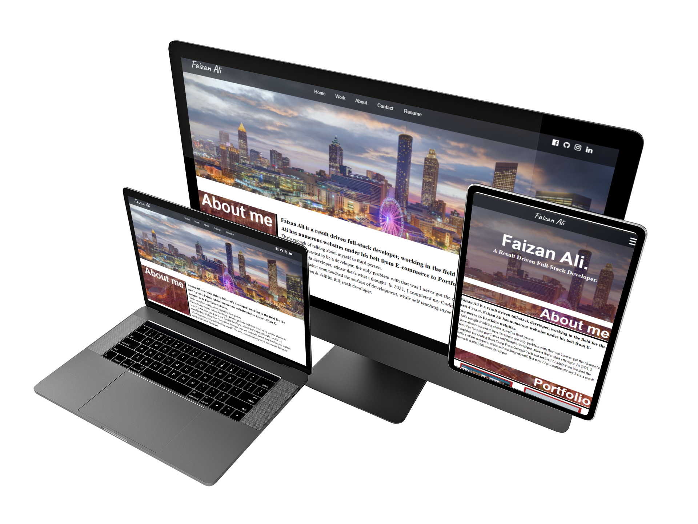

# Full Stack Portfolio
```md
    
    ```

## Table of Contents (Optional)
- [About](#about)
- [Usage](#usage)
- [Credits](#credits)
- [Features](#features)


## About
Faizan Ali is a result driven full-stack developer, working in the field for the past 4 years. Faizan Ali has numerous websites under his belt from E-commerce to Portfolio websites.
This Portfolio was designed to showcase the work of Faizan Ali. This portfolio design was referenced and inspired by many places and applied with all skills learnt at W3 School, Mozilla MDN and GA Tech Coding Bootcamp


## Usage
This profeesional portfolio is used to showcase that work of Faizan Ali, and for conatc and hiring purposes only.

## Credits
- [Faizan Ali](https://github.com/alifaizan786-op)
- [MDN Web Docs](https://developer.mozilla.org/en-US/)
- [W3 Schools](https://www.w3schools.com/)

## Features
If your project has a lot of features, list them here.

